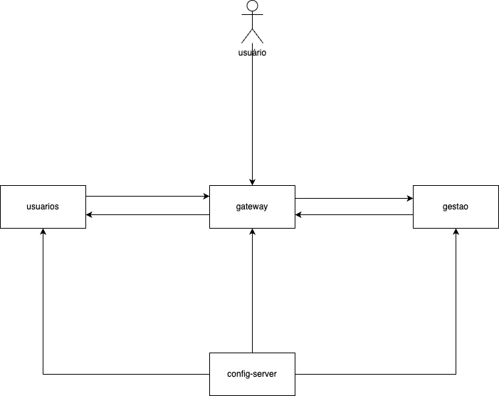

<h1 align="center" style="font-family: Arial, sans-serif; color: #FFFF00;">
  Compra Fácil
</h1>

<p align="center">
 <br />
<span style="font-family: Arial, sans-serif; color: #FF0000;">Em construção</span>
</p>

## Sumário

1. [Introdução](#introdução)
2. [Objetivo](#objetivo)
3. [Funcionalidades Principais](#funcionalidades-principais)
    - [Login e Registro de Usuário](#login-e-registro-de-usuário)
    - [Gestão de Itens](#gestão-de-itens)
    - [Carrinho de Compras](#carrinho-de-compras)
    - [Pagamentos (Simulação)](#pagamentos-simulação)
4. [Instalação](#instalação)
5. [Subindo os Serviços](#subindo-os-serviços)
6. [Arquitetura](#arquitetura)
    - [Motivação para a Escolha da Arquitetura](#motivação-para-a-escolha-da-arquitetura)
    - [API Gateway](#api-gateway)
    - [Eureka Server](#eureka-server)
    - [Considerações Finais](#considerações-finais)
7. [Notas Importantes](#notas-importantes)
8. [Contribuição](#contribuição)
9. [Licença](#licença)

## Introdução

O "Compra Fácil" é um software inovador de gerenciamento de carrinho de compras e gestão, projetado para oferecer uma
experiência de compra eficiente e intuitiva. Este sistema é ideal para lojas on-line, supermercados e qualquer
estabelecimento que necessitam de uma solução robusta para facilitar o processo de compra dos seus clientes.

## Objetivo

O objetivo do "Compra Fácil" é simplificar o processo de compra para os clientes, ao mesmo tempo em que oferece aos
gestores ferramentas para controlar e otimizar as operações de vendas e estoque.

## Funcionalidades Principais

### Login e Registro de Usuário

Os usuários devem ser capazes de se cadastrar e fazer login no sistema usando as ferramentas do Spring Security para
autenticação e autorização.

**Funcionalidades:**

- **Registro de Usuário:**
    - Formulário de registro contendo campos como nome, email, senha e confirmação de senha
    - Validação dos dados do usuário no lado do cliente e no servidor
    - Armazenamento seguro da senha usando hashing
- **Login de Usuário:**
    - API de login com variáveis para email e senha
    - Autenticação de usuário usando Spring Security
    - Gestão de sessões de usuário utilizando tokens do Spring Security
- **Autorização:**
    - Controle de acesso a diferentes partes do sistema com base nas permissões do usuário (usuário comum,
      administrador)
    - Middleware de verificação de permissões antes de permitir o acesso a rotas protegidas.

### Gestão de Itens

Os usuários administradores terão acesso a uma tela de gestão de itens, permitindo o controle do cadastro e manutenção
de itens, bem como seus preços.

**Funcionalidades:**

- **Listagem de Itens:**
    - Exibição de uma tabela/lista de itens cadastrados com informações básicas (nome, descrição, preço).
- **Cadastro de Novo Item:**
    - API para adicionar um novo item, incluindo campos como nome, descrição, categoria, preço, URL da imagem e
      quantidade.
    - Validação para saber se o usuário tem permissão de fazer essa função.
- **Edição de Item:**
    - Opção para editar informações de um item existente.
    - Atualização dos dados no banco de dados.
    - Validação para saber se o usuário tem permissão de fazer essa função.
- **Remoção de Item:**
    - Função para remover itens do sistema.
    - Validação para saber se o usuário tem permissão de fazer essa função.

### Carrinho de Compras

Os usuários podem adicionar e remover itens do carrinho de compras. O carrinho de compras deve ser persistente e
associado ao usuário logado.

**Funcionalidades:**

- **Adição de Itens ao Carrinho:**
    - Adicionar um item e quantidade a um carrinho.
- **Remoção de Itens do Carrinho:**
    - Remoção de um item e de sua quantidade.
- **Visualização do Carrinho:**
    - Consulta que lista de itens no carrinho do cliente.

### Pagamentos (Simulação)

Implementar um serviço que vai chamar uma API de pagamento passando um carrinho.

**Funcionalidades:**

- **Resumo do Carrinho:**
    - Listar todos os itens do carrinho.
    - Colocar no final um resumo de quantidade de itens e soma de valores.
- **Simulação de Transação:**
    - Envia para um endpoint mockado lista de itens, custo total e o tipo de pagamento (Cartão, Boleto, Débito, Pix).
    - O endpoint mockado vai sempre retornar "pagamento realizado com sucesso".

## Instalação

1. Clone o repositório:
    ```sh
    git clone https://github.com/rafaelteixeirarnnt/comprafacil.git
    ```
2. Navegue até o diretório do projeto:
    ```sh
    cd comprafacil
    ```

## Subindo os Serviços

1. Compile o projeto usando Maven:
    ```sh
    mvn clean install
    ```
2. Configure as variáveis de ambiente e crie as configurações de execução para cada módulo (Config-server,
   Eureka-server, Api-gateway, Usuarios, Gestao).

3. Inicie os módulos na seguinte ordem:
    * 1 - Config-server
    * 2 - Eureka-server - [URL](http://localhost:8761/)
    * 3 - Api-gateway -
    * 4 - Usuarios - [Swagger](http://localhost:8080/usuarios/swagger-ui/index.html)

## Arquitetura
<p align="center">
 <br />
</p>

### Motivação para a Escolha da Arquitetura

O projeto **Compra Fácil** foi desenvolvido com uma arquitetura baseada em microserviços, utilizando um API Gateway e o
Eureka Server para registro e descoberta de serviços. Esta escolha foi motivada por diversos fatores que visam melhorar
a escalabilidade, a manutenção e a resiliência da aplicação.

### API Gateway

O **API Gateway** é um componente essencial em arquiteturas de microserviços. Ele atua como um ponto central de entrada
para todas as requisições, proporcionando diversas vantagens:

1. **Centralização de Autenticação e Autorização**: Permite centralizar a lógica de segurança, como autenticação e
   autorização, evitando a duplicação de código e garantindo uma política de segurança uniforme em todos os serviços.
2. **Gerenciamento de Tráfego**: Facilita o gerenciamento de tráfego de entrada, podendo realizar balanceamento de
   carga, limitação de taxa (rate limiting) e roteamento inteligente baseado em regras.
3. **Transformação de Requisições**: Possibilita a transformação de requisições e respostas, como agregação de dados de
   múltiplos serviços em uma única resposta.
4. **Simplificação do Cliente**: Os clientes (aplicações frontend ou outras APIs) interagem apenas com o Gateway,
   simplificando a comunicação com os microserviços, sem precisar conhecer a estrutura interna dos mesmos.

### Eureka Server

O **Eureka Server** foi escolhido como o serviço de descoberta de microserviços, oferecendo os seguintes benefícios:

1. **Registro e Descoberta de Serviços**: Permite que os serviços se registrem e sejam descobertos dinamicamente por
   outros serviços. Isso facilita a comunicação entre microserviços sem a necessidade de configurar manualmente os
   endpoints.
2. **Alta Disponibilidade**: O Eureka Server suporta configuração em cluster, aumentando a disponibilidade e a
   resiliência do sistema.
3. **Escalabilidade**: Com a descoberta dinâmica de serviços, é possível escalar horizontalmente os microserviços
   conforme a demanda, sem impactar negativamente na comunicação entre eles.
4. **Failover e Redundância**: Em caso de falha de um serviço, o Eureka Server pode direcionar as requisições para
   instâncias disponíveis, garantindo continuidade no atendimento.

### Considerações Finais

A escolha de uma arquitetura baseada em microserviços com um API Gateway e o Eureka Server alinha-se com as melhores
práticas para desenvolvimento de sistemas distribuídos. Essa abordagem não apenas melhora a escalabilidade e a
resiliência, mas também facilita a manutenção e a evolução contínua da aplicação. Com o API Gateway, garantimos um ponto
único de entrada para as requisições, simplificando a comunicação e a aplicação de políticas de segurança. O Eureka
Server, por sua vez, proporciona um mecanismo robusto para registro e descoberta de serviços, essencial para a
flexibilidade e a escalabilidade do sistema.

## Notas Importantes

- Após subir todos os serviços, aguarde alguns segundos para que todos os serviços estejam completamente operacionais e
  registrados no Eureka Server.
- Certifique-se de que todos os serviços estão rodando corretamente no Docker antes de iniciar o uso.

## Licença

Este projeto está licenciado sob a licença MIT. Veja o arquivo [LICENSE](LICENSE) para mais detalhes.